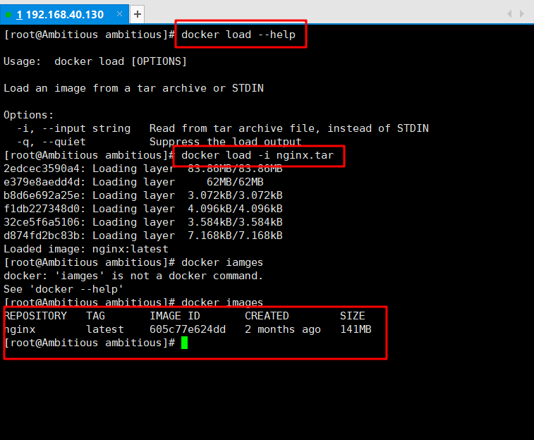
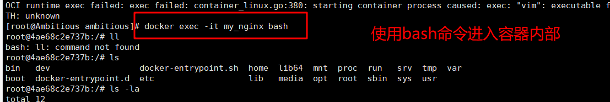
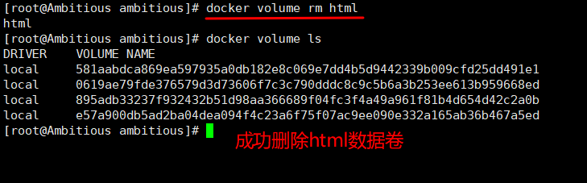

# 容器化部署工具Docker学习笔记

学习过程中使用Centos7虚拟机

## 1. Docker的卸载

```shell
yum remove docker \
			docker-client \
			docker-client-latest \
			docker-common \
			docker-latest \
			docker-latest-logrotate \
			docker-logrotate \
			docker-selinux \
			docker-engine-selinux \
			docker-engine \
			docker-ce
```

## 2. 安装Docker

### 2.1 安装yum工具

```shell
yum install -y yum-utils \
				device-mapper-persistent-data \
				lvm2 --skip-broken
```

### 2.2 更新本地镜像源

```shell
yum-config-manager \
	--add-repo \
	https://mirrors.aliyun.com/docker-ce/linux/centos/docker-ce.repo
	
sed -i 's/download.docker.com/mirrors.aliyun.com\/docker-ce/g' /etc/yum.repos.d/docker-ce.repo

yum makecache fast
```

### 2.3 安装docker-ce（社区免费版）

```shell\
yum -y install docker-ce
```

### 2.4 关闭防火墙

docker运行时需要用到各种各样的端口，在企业中，需要逐个配置到防火墙中

而现在是学习阶段，直接关闭防火墙就可以了

```shell
# 关闭防火墙
systemctl stop firewalld
# 禁用开机自启
systemctl disable firewalld
```

### 2.5 启动docker

```shell
systemctl start docker

# 查看版本号验证是否开启成功
docker -v
```

### 2.6 配置阿里云镜像

```shell
sudo mkdir -p /etc/docker
```

```shell
sudo tee /etc/docker/daemon.json <<- 'EOF'
{
  "registry-mirrors": ["https://n0dwemtq.mirror.aliyuncs.com"]
}
EOF
```

```shell
sudo systemctl daemon-reload
sudo systemctl restart docker
```

## 3. Docker基本操作

### 3.1 镜像操作

构建镜像

```shell
docker build
```

从服务端拉取镜像

```
docker pull
```

推送镜像到服务

```
docker push
```

查看镜像

```
docker images
```

删除镜像

```
docker rmi
```

保存镜像为一个压缩包

```
docker save
```

加载压缩包为镜像

```
docker load
```


**案例：拉取nginx镜像并查看**

可以从DockerHub网站`hub.docker.com`查找镜像

```shell
docker pull nginx
docker images
```


**案例：将nginx镜像保存为压缩包，并重新加载**

使用docker save --help命令可以查看详细使用方法

- 保存镜像


- 删除当前的nginx镜像


- 重新加载镜像



### 3.2 容器操作

根据已有的镜像创建容器并运行

```sh
docker run
```

暂停容器

```shell
docker pause
```

恢复容器运行

```shell
docker unpause
```

停止容器运行

```sh
docker stop
```

容器重新运行

```sh
docker start
```

查看所有正在运行的容器的状态

```sh
docker ps
```

查看容器运行日志

```sh
docker logs
```

进入容器执行命令

```sh
docker exec
```

删除指定容器

```sh
docker rm
```


**案例：创建并运行一个nginx容器**

> 创建语法
>
> docker run --name [容器名称] -p [端口映射] -d [镜像名称]
>
> - 容器名称：用来后续操作容器的唯一id
>
> - 端口映射：配置服务器端口和容器端口的映射，如8080:80表示当前容器端口为80，当外界访问服务器的8080端口时，可以自动被映射到80端口容器
>
> - 镜像名称：举例，nginx:latest
> - -d：让容器后台运行

- 创建nginx容器


- 查看当前服务器中的容器


- 浏览器访问80端口测试


**案例：进入nginx容器执行命令**

容器内部中只有nginx运行所必须的文件，像vim这种命令是不能使用的

> 进入命令
>
> docker exec -it [容器名称] [要执行的命令]
>
> -it：开启输入输出流
>
> 执行的命令通常是bash，可以进入容器的内部




**案例：创建一个redis容器，并支持持久化**

- 从官网中拉取5.0.14版本的redis镜像

```sh
docker pull redis:5.0.14
```

- 创建redis容器，起名为my_redis，容器后台运行，并且支持持久化
  - `--save 60 1`命令的意思是每60秒只要有一个写操作发生就执行持久化操作

```sh
docker run --name my_redis -d redis:5.0.14 redis-server --save 60 1 --loglevel warning
```

- 进入redis容器中，连接redis服务器，并存入一条数据

```sh
docker exec -it my_redis bash

redis-cli

set num 666
```

### 3.3 数据卷（volume）操作

数据卷是虚拟的，可以解决无法修改容器内部文件的问题，并且可实现配置文件复用。原理是在宿主机上创建一个真实目录，并由数据卷指向这个真实目录，容器只需要将内部的文件挂载到数据卷上，就可以跟真实目录进行双向绑定。

**基本命令**

创建一个volume

```sh
docker volume create
```

显示一个或多个volume的信息

```sh
docker volume inspect 
```

列出所有的volume

```sh
docker volume ls
```

删除未使用的volume

```sh
docker volume prune
```

删除指定的volume

```sh
docker volume rm
```


**案例：创建一个数据卷并执行一些简单操作**

- 创建名为html的数据卷，并查看当前所有的数据卷


- 查看html数据卷的详细信息


- 删除数据卷




**数据卷挂载**

挂载命令（创建容器时，如果数据卷不存在，docker会自动创建数据卷）：

> -v 数据卷名称：容器内要进行挂载的目录


**案例：创建一个nginx容器，将html目录挂载到数据卷html，使用vim修改里面的内容**

- 创建nginx容器并挂载


- 进入html数据卷所在目录，修改index.html即可


**将宿主机文件/目录直接挂载到容器中**

**案例：创建并运行mysql容器，挂载conf文件和data目录**

- 拉取MySQL镜像

```sh
docker pull mysql:5.7.25
```

- 创建配置文件目录和配置文件

```sh
mkdir -p /tmp/mysql/conf
cd /tmp/mysql/conf
touch my.cnf
```

- 创建数据存储目录

```sh
cd ..
mkdir data
```

- 创建并运行MySQL容器

  - 指定环境变量`-e MYSQL_ROOT_PASSWORD=cyj070723`
  - 挂载配置文件`-v /tmp/mysql/conf/my.cnf:/etc/mysql/conf.d/my.cnf`
  - 挂载数据目录`-v /tmp/mysql/conf/data:/var/lib/mysql`
  - 指定后台运行
  - 端口映射
  - 容器名称
  - 镜像

  > 最终命令如下：
  >
  > docker run \
  >
  > ​    --name my_sql \
  >
  > ​    -p 3306:3306 \
  >
  > ​    -e MYSQL_ROOT_PASSWORD=cyj070723 \
  >
  > ​    -v /tmp/mysql/conf/my.cnf:/etc/mysql/conf.d/my.cnf \
  >
  > ​    -v /tmp/mysql/data:/var/lib/mysql \
  >
  > ​    -d \
  >
  > ​    mysql:5.7.25


## 4. 自定义镜像

### 4.1 镜像结构（由下到上）

- 基础镜像（BaseImage）
  - 应用依赖的**系统**函数库、环境、配置、文件等。
- 层（Layer）
  - 在BaseImage的基础上添加安装包、依赖、配置等，**每次操作都形成新的一层**。
- 入口（Entrypoint）
  - 镜像运行入口，一般是**程序启动的脚本**和参数。

### 4.2 Dockerfile

Dockerfile是一个文本文件，其中包含一个个的**指令（Instruction）**，用指令来说明要执行什么操作来构建一个镜像。**每一个指令都会形成一层Layer**。

Dockerfile的常用指令如下：

|    指令    |                     说明                     |            示例             |
| :--------: | :------------------------------------------: | :-------------------------: |
|    FROM    |                 指定基础镜像                 |        FROM centos:6        |
|    ENV     |        设置环境变量，可在后面指令使用        |        ENV key value        |
|    COPY    |         拷贝本地文件到镜像的指定目录         |  COPY ./mysql-5.7.rpm /tmp  |
|    RUN     |  执行Linux的shell命令，一般是安装过程的命令  |     RUN yum install gcc     |
|   EXPOSE   | 指定容器运行时监听的端口，是给镜像使用者看的 |         EXPOSE 8080         |
| ENTRYPOINT |     镜像中应用的启动命令，容器运行时调用     | ENTRYPOINT java -jar xx.jar |

> 详细语法说明：https://docs.docker.com/engine/reference/builder

### 4.3 DockerCompose

- DockerCompose可以基于Compose文件帮我们快速的部署分布式应用，而无需手动一个个创建和运行容器
- Compose文件是一个文本文件，通过指令定义集群中的每个容器如何运行

示例：

```yaml
version: "3.8"

services:
  mysql:
    image: mysql:5.7.25
    environment:
      MYSQL_ROOT_PASSWORD: 123
    volumes: 
      - /tmp/mysql/data:/var/lib/mysql
      - /tmp/mysql/conf/my.cnf:/etc/mysql/conf.d/my.cnf
  web: 
    build: .
    ports: 
      - 8090: 8090
```

> 官网详细语法：https://docs.docker.com/compose/compose-file/

**DockerCompose的安装**

1. 下载安装命令

```sh
curl -L https://github.com/docker/compose/releases/download/1.29.1/docker-compose-`uname -s`-`uname -m` > /usr/local/bin/docker-compose
```

2. 修改文件权限

```sh
# 给docker-compose文件添加执行权
chmod +x /usr/local/bin/docker-compose
```

3. 添加自动补全命令（在编辑compose文件的时候可以提示）

```sh
curl -L https://raw.githubusercontent.com/docker/compose/1.29.1/contrib/completion/bash/docker-compose > /etc/bash_completion.d/docker-compose
```

**使用docker-compose将cloud-demo微服务项目部署到服务器上**

1. 在本地准备一个文件夹，内部包括：
   - 每个微服务拥有一个单独的文件夹，文件夹中存有两个文件，Dockerfile和jar包
   - docker-compose.yml文件，配置微服务的启动参数

2. 将cloud-demo文件夹推送到服务器中
3. 切换到cloud-demo目录下，执行命令`docker-compose up -d`即可自动构建服务并运行
